# Seatlane

**Pick a seat, hold it for ten minutes, confirm.** Seatlane is a small
seat-booking app for live shows where two people can never hold the same
seat, a hold that runs out frees the seat for the next person, and every one
of those rules can be reviewed in plain English before it ships.

The backend is Go + [sqlc](https://sqlc.dev) on SQLite, written as feature
slices that [bridge-en](https://github.com/pierre10101/go-ai-bridge) compiles
to controlled English. The UI is a thin React app (Vite, TypeScript,
Tailwind, shadcn/ui, lucide-react, framer-motion) that draws exactly what the
server says.

| Light | Dark |
|---|---|
| 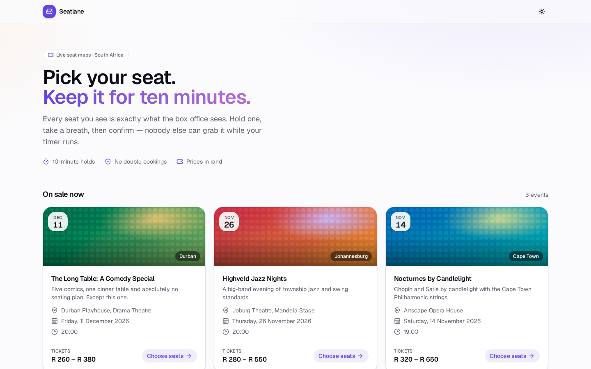 | 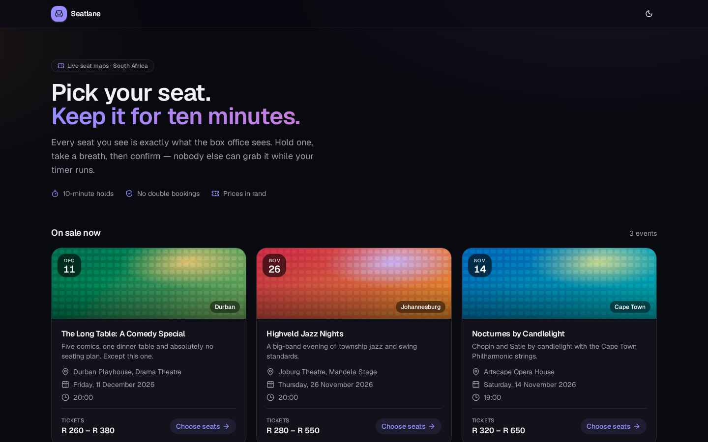 |
| 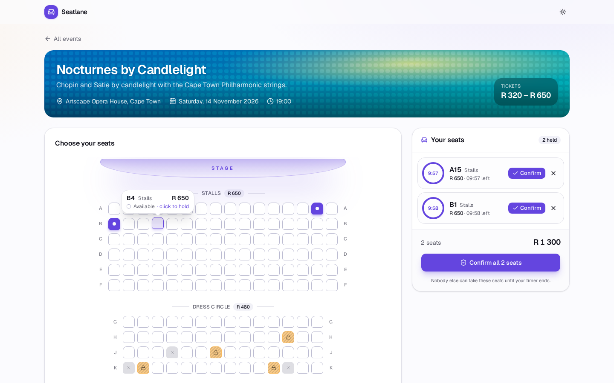 | 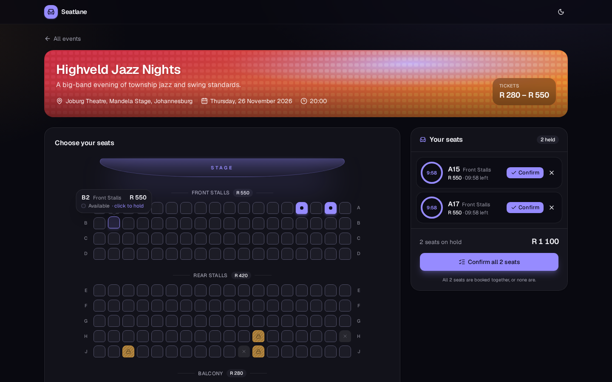 |
| 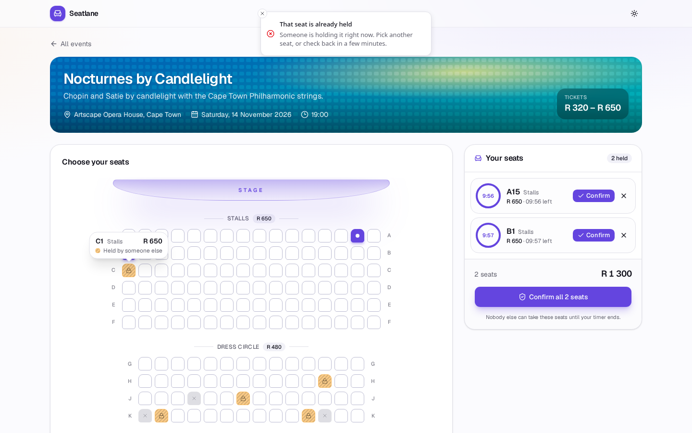 |  |
| 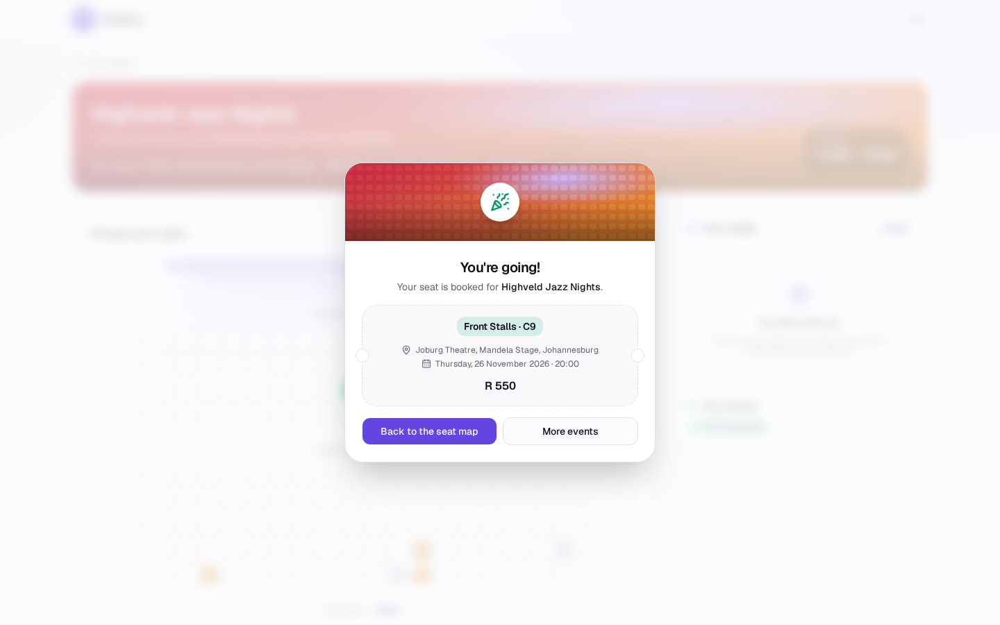 | 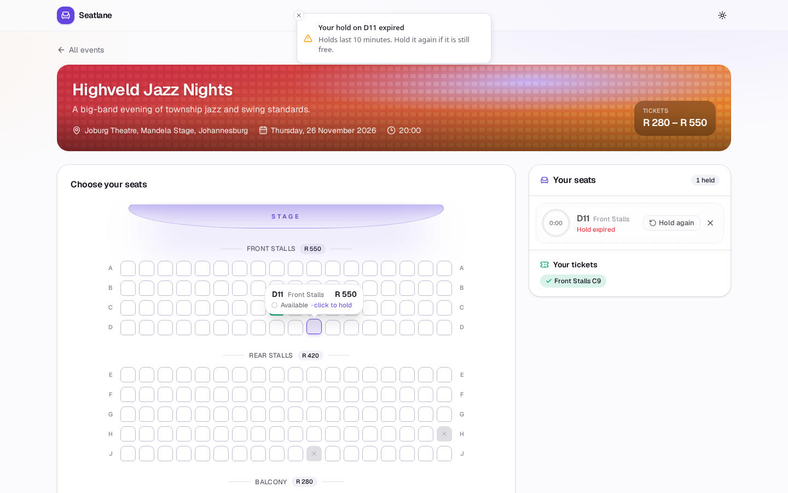 |
| 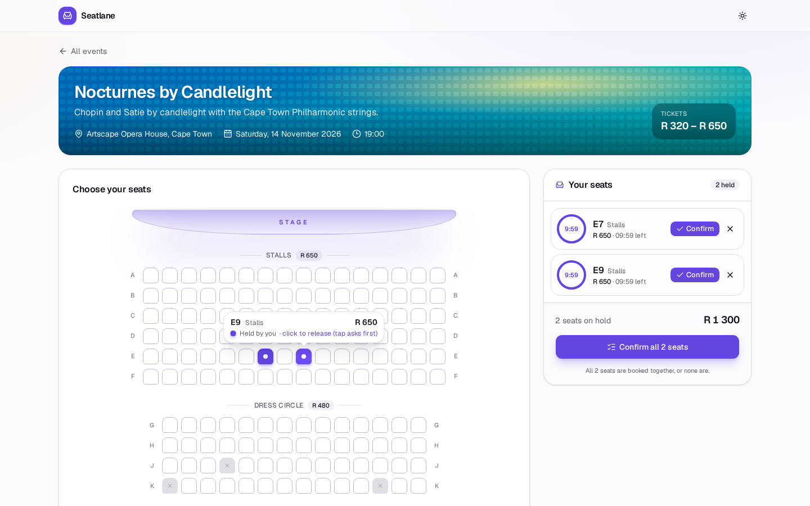 | 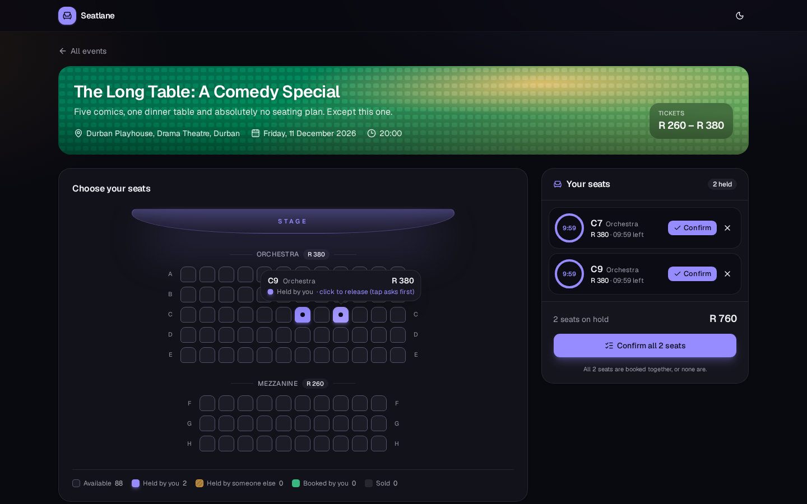 |
| 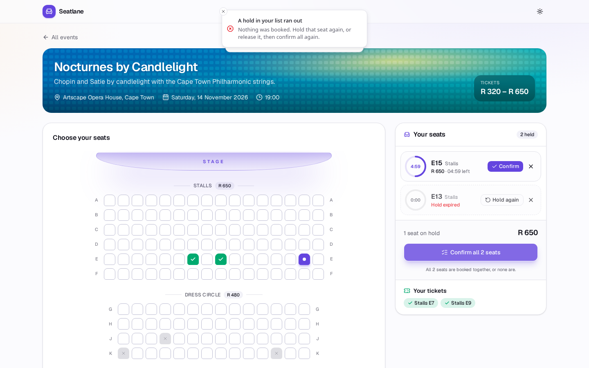 | 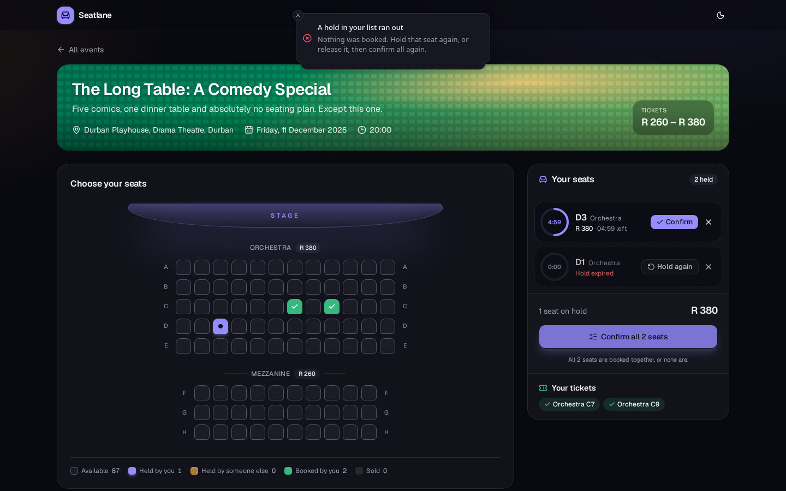 |

<p align="center">
  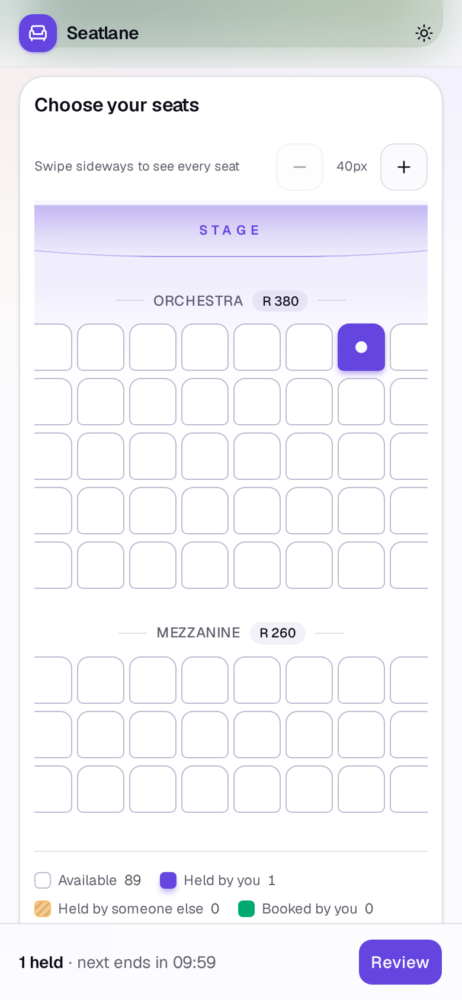
  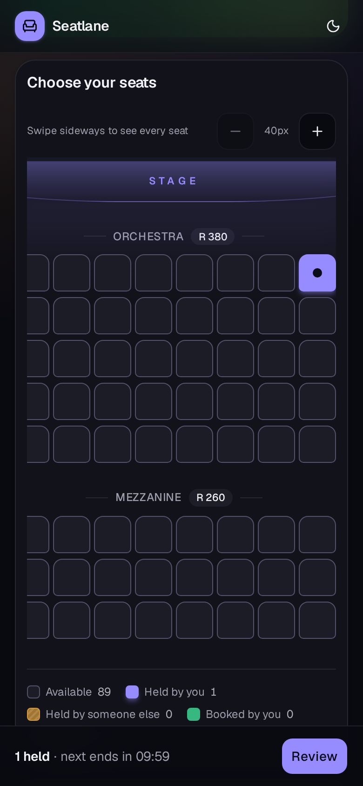
  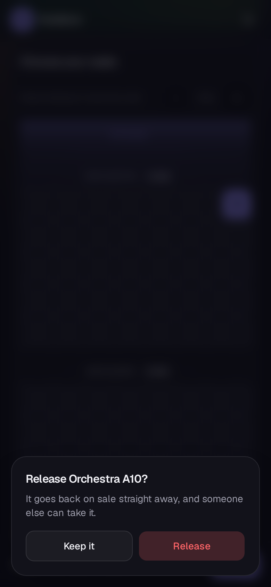
</p>

## How it works

- **One slice per action** under `features/`: `list_events`, `show_seat_map`,
  `list_my_holds`, `hold_seat`, `confirm_hold`, `confirm_holds`, `release_hold`, `me`. Each has an
  `intent.md` (why, inputs, outputs, failure cases written first), plain SQL in
  `queries/`, sqlc code in `db/`, the action in `action.go`, one check per
  failure ID in `checks/`, and its English in `<slice>.en`.
- **Check and write in one statement.** Holding, confirming and releasing are
  each a single conditional `UPDATE` ("only if, at that moment, the seat is
  not sold and nobody holds it or its hold has expired") whose changed-row
  count must be exactly one. Reads after it only explain why it changed
  nothing (F1, F6, ...). Check-then-write is refused by bridge-en.
- **Several seats: all or none.** `confirm_holds` takes `seat_ids` (1 to 20
  ids, no duplicates; anything else is a 400) and sells them with one
  conditional `UPDATE ... AND id IN (sqlc.slice(seat_ids))`; unless it changed
  exactly one row per listed seat, the transaction rolls back and no seat is
  sold (F2 if one of the holds has expired, F13 if a seat is not held by you).
- **The server owns time and identity.** `now` (`clock:"now"`), `user`
  (`server:"user"`) and `role` (`server:"role"`) are set by the bridge-en
  runtime from the server clock and the signed-in session; a request that
  sends any of them is a 400. A hold is active while `expires_at` is later
  than now: a hold taken exactly 600 seconds ago has expired, one taken 599
  seconds ago has not.
- **Roles, deny by default.** The app's roles are declared once in
  `cmd/server/routes.go` (`httpx.AppRoles("customer", "organizer", "admin")`)
  and every slice declares `var Roles`: `list_events` and `show_seat_map` are
  `httpx.Public`; holding, confirming, releasing and listing your holds are
  `httpx.Roles("customer")`; `me` is for every role. `httpx.Bind` answers 401
  (`unauthorized`) when nobody is signed in and 403 (`forbidden`) for another
  role, before the action reads anything. Organizers and admins exist as
  roles, but no slice grants them more yet; ownership rules wait for
  bridge-en rule A4.
- **Accounts and sessions** (`internal/auth`, app code: see
  [docs/bridge-en-gaps.md](docs/bridge-en-gaps.md) for why these are not
  slices). Sign-up stores a bcrypt hash (cost 12) of a 10-72 byte password;
  the email is trimmed and lower-cased, and a duplicate is F16 even under
  concurrent sign-ups (`INSERT ... ON CONFLICT DO NOTHING`). Sign-in answers
  F17 for an unknown email and for a wrong password alike (an unknown email is
  checked against a dummy hash, so it takes as long). A session is 32 random
  bytes in the `seatlane_auth` cookie (`HttpOnly`, `SameSite=Lax`, `Path=/`,
  `Secure` over TLS, 7 days); the database stores only its SHA-256.
  `httpx.Identify(AppRoles, identity, mux)` turns it into the user id and
  role through the `httpx.Identity` hook. `held_by` and `sold_to` store the
  user id, with `0` meaning nobody.
- **CSRF.** Every `POST`/`PUT`/`PATCH`/`DELETE` under `/api/` must send
  `X-CSRF-Token` equal to the `seatlane_csrf` cookie (double submit). The
  token is `nonce.HMAC-SHA256(key, nonce | sha256(session))`, so it is only
  valid with the sign-in session it was issued for, and a cross-site `Origin`
  or `Sec-Fetch-Site` is refused too. Anything else is F19 (403), with a
  fresh cookie so the web app can retry once. The key comes from
  `SEATLANE_CSRF_KEY` (64 hex characters) or is random per process.
- **Sign-in rate limit.** Two caps, each per 15-minute window: at most 5
  failed sign-ins per client IP + email, and at most 20 failed sign-ins per
  client IP across all emails. Once either is reached, the next attempt is
  F18 (429, `Retry-After`) without checking the password. There is no cap per
  email across IPs, so nobody can lock an account's owner out from elsewhere.
  The rules are pure functions, `auth.ReserveBoth(pair, ip, now)` and
  `auth.Refund`, and `now` is passed in (`httpx.Now()`, which the dev clock
  replaces). Each attempt is counted against both caps inside the same
  locked transaction that reads them, before the password is checked, so
  parallel guesses cannot get past either limit. A successful sign-in
  clears its IP + email count and gives back its one in the IP count, so
  only failures use up the IP's 20.
- **Errors carry a stable ID.** Every failure is
  `{"error": {"id": "F1", "message": "..."}}`; the catalogue is in
  [docs/failures.md](docs/failures.md). The UI maps `error.id` to friendly
  copy and never reads the message.

### A thin UI

All seat and hold rules live in Go. The web app:

- draws each seat from the server's five flags (`available`, `held_by_me`,
  `held_by_other`, `sold_to_me`, `sold_to_other`) and never decides on its own
  whether a seat is free or a hold has expired;
- counts down from `expires_at - now` as the server reported it (from the hold
  answer and `GET /api/events/{id}/holds`), minus the time since that answer
  arrived; it re-reads the server when a countdown reaches zero and every 4
  seconds, and only shows a hold as expired when the server's `active` flag
  says so;
- shows a pending state the moment you click a seat, then reconciles with the
  server's answer; every failure ID gets a toast with its own copy.

On screens under 640px every seat is a tap target of at least 40px; the map
scrolls sideways inside its card and has +/- buttons for bigger seats (40,
48, 56px). Tapping your own held seat on a touch screen asks "Release …?"
before giving it back; a mouse click or Enter releases at once.

**All seats together, or none.** "Confirm all N seats" sends one
`confirm_holds` call with every seat shown in the panel: "All N seats are
booked together, or none are." If any of them cannot be sold (a hold ran out,
F2; a seat is no longer yours, F13), nothing is booked, your other holds stay
as they were, and a toast says which failure it was. Each seat still has its
own Confirm button, which books just that seat (`confirm_hold`).

The seat map is keyboard-navigable (arrow keys, Home/End, Enter), has
hover/focus tooltips with the seat label and price in rand, and announces
holds, releases, bookings, expiries and errors in an `aria-live` region.

## Where the English lives

Each slice's review copy sits next to its code:

```
features/hold_seat/hold_seat.en          features/confirm_hold/confirm_hold.en
features/release_hold/release_hold.en    features/show_seat_map/show_seat_map.en
features/list_my_holds/list_my_holds.en  features/list_events/list_events.en
features/confirm_holds/confirm_holds.en  features/me/me.en
```

Sign-up, sign-in and sign-out have no `.en`: they are not bridge-en slices.
Their intent is in `internal/auth/{sign_up,sign_in,sign_out,csrf}/intent.md`,
and `internal/auth/intent_test.go` cross-checks those F-IDs against the code
and the checks.

They are generated (`bridge-en -write`), never edited by hand, and checked in
CI (`bridge-en -check features/*/`): the check fails if the code and its
English drift apart, if a slice uses a construct outside the
[rulebook](https://github.com/pierre10101/go-ai-bridge/blob/v0.3.0/RULEBOOK.md),
or if the failure IDs in `intent.md`, `action.go` and `checks/` differ. Each
`intent.md` lists its failure cases under exactly one `## Failure cases`
heading, one `- F<n>: <text>` line each. Read a `.en` diff in a pull request
the way you would read the code: on every pull request, CI posts one comment
(updated on each push) with each changed feature's intent next to its English
diff.

Agents (and people) changing the app follow [AGENTS.md](AGENTS.md), written
by `bridge-en init`; `CLAUDE.md`, `GEMINI.md`, `.cursor/rules/bridge-en.mdc`
and `.github/copilot-instructions.md` point to it.

## Run it

Requirements: Go 1.24, Node 20.19+ (22 recommended), and for `make check` the
bridge-en binary of the version `go.mod` pins (`make tools`).

```sh
make tools   # go install github.com/pierre10101/go-ai-bridge/cmd/bridge-en@<pinned version>
make dev     # Go API with the dev clock on :8080, Vite on http://localhost:5173 (proxies /api)
make build   # web/dist + bin/seatlane
make run     # build, then serve the API and web/dist on http://localhost:8080
make check   # bridge-en -check features/*/
make test    # go vet + go test ./...
```

The server seeds three demo events into an empty database. With `-dev-clock`
(on in `make dev`), `POST /__dev/advance?seconds=N` moves the server clock
forward, so you can watch a hold expire without waiting ten minutes:

```sh
curl -X POST 'http://localhost:8080/__dev/advance?seconds=600'
```

After changing `schema.sql` or a query, run `make generate` (sqlc + the
`.en` files) and review the diff. A local database from before phase 1 (with
TEXT session columns and no `users` table) must be deleted (`rm seatlane.db`);
the server seeds a fresh one.

Everyone who signs up is a `customer`. To make an organizer or admin, change
the role by hand:

```sh
sqlite3 seatlane.db "UPDATE users SET role = 'organizer' WHERE email = 'olga@example.com';"
```

Set `SEATLANE_CSRF_KEY` (64 hex characters, e.g. `openssl rand -hex 32`) to
keep CSRF tokens valid across restarts. Without it, each start picks a random
key, and the web app gets a new token when it next retries.

## API

| Route | Handler | Who | Failure IDs |
|---|---|---|---|
| `GET /api/events` | list_events | everyone | F11, F12 |
| `GET /api/events/{id}/seats` | show_seat_map | everyone | F10, F11, F12 |
| `GET /api/events/{id}/holds` | list_my_holds | customer | F11, F12 |
| `POST /api/holds` `{"seat_id"}` | hold_seat | customer | F1, F6, F7 |
| `POST /api/holds/confirm` `{"seat_id"}` | confirm_hold | customer | F2, F3, F4, F5, F6, F7 |
| `POST /api/holds/confirm-all` `{"seat_ids"}` | confirm_holds | customer | F2, F13 |
| `POST /api/holds/release` `{"seat_id"}` | release_hold | customer | F5, F6, F7, F9 |
| `GET /api/me` | me | customer, organizer, admin | |
| `POST /api/sign-up` `{"email","password"}` | internal/auth | everyone | F14, F15, F16 |
| `POST /api/sign-in` `{"email","password"}` | internal/auth | everyone | F17, F18 |
| `POST /api/sign-out` | internal/auth | everyone | |

Any route that is not for everyone can also answer 401 `unauthorized` or 403
`forbidden`, and every `POST` can answer F19 (CSRF).

## Layout

```
cmd/server/        main (store.Open, seed, -dev-clock, CSRF) and routes.go (AppRoles, one httpx.Bind per slice, httpx.Identify)
features/<slice>/  intent.md, action.go, queries/, db/, checks/, <slice>.en
internal/domain/   value objects and pure seat rules (rendered into the English)
internal/auth/     accounts, bcrypt, sessions, the identity hook, CSRF, sign-in rate limit (app code + intent.md)
internal/web/      serves web/dist with the SPA fallback (and the CSRF cookie)
web/               the React app
docs/              failures.md, screenshots/
```

## License

MIT. See [LICENSE](LICENSE).
